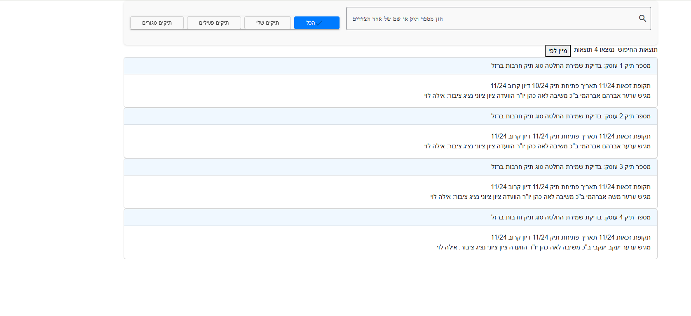

# מערכת ניהול בתי דין - ארכיטקטורה מבוססת מיקרו-שירותים

## **צד שרת**
ניתן לראות את הקוד [כאן](https://github.com/LeahFeldheim/CourtsTask/tree/master/CourtsTaskAPI)
## **צד לקוח**
ניתן לראות את הקוד [כאן](https://github.com/LeahFeldheim/CourtsTask/tree/master/src)

## **תיאור המערכת**
מערכת ניהול בתי הדין נועדה לנהל באופן מקיף את מחזור החיים של תיקים משפטיים, החל מהגשת התיק, דרך ניהול דיונים, מסמכים, החלטות ובקשות, ועד הפצת הודעות לגורמים הרלוונטיים. המערכת בנויה על ארכיטקטורת מיקרו-שירותים, תוך הקפדה על חלוקה לוגית, תקשורת יעילה בין רכיבי המערכת, ואבטחה גבוהה.

---

## **חלוקת המערכת למיקרו-שירותים**

### **Core Services** (שירותי ליבה)

#### **Case Service** - ניהול מחזור חיי התיק
- יצירת תיק חדש
- עדכון סטטוס תיק
- ניהול החלטות ובקשות ביניים

#### **User Service** - ניהול משתמשים
- שמירת נתוני משתמשים ותפקידים
- ניהול הרשאות על בסיס OAuth 2.0

#### **Document Service** - ניהול מסמכים
- העלאה, שמירה וגרסאות של מסמכים
- אחסון המסמכים ב-Amazon S3 עם מטא-דאטה ב-PostgreSQL

#### **Hearing Service** - ניהול דיונים
- תזמון דיונים
- ניהול פרוטוקולים וזימון משתתפים

---

### **Supporting Services** (שירותים תומכים)

#### **Notification Service** - שירות התראות
- שליחת מיילים, הודעות SMS והתראות מערכת
- תיעדוף הודעות (High Priority/Low Priority)

#### **Audit Service** - שירות מעקב
- תיעוד פעולות משתמשים ושירותים
- שמירת לוגים ב-Elasticsearch לצורך חיפוש וניתוח

#### **Search Service** - שירות חיפוש
- אינדוקס תיקים, מסמכים ודיונים ב-Elasticsearch
- מענה על חיפושים טקסטואליים וסינונים מתקדמים

---

## **תקשורת בין רכיבי המערכת**

### **API Gateway**
- משמש כשכבת כניסה מאובטחת לכלל השירותים.
- תומך ב-Rate Limiting, אימות באמצעות JWT והפניית קריאות לשירותים המתאימים.

### **Message Queue**
- **RabbitMQ**: נבחר לניהול התראות.
- **Kafka**: נבחר לתיעוד פעולות ולוגים.

### **קריאות סינכרוניות**
- מתבצעות ב-REST.
- בין שירותי ליבה, לדוגמה: Case Service פונה ל-User Service לאימות נתונים.

### **קריאות אסינכרוניות**
- תור ההודעות (RabbitMQ/Kafka) משמש לתקשורת שאינה דורשת תגובה מיידית.
- מבטיח עמידות בתקלות, עם מנגנון Retry מובנה.

---

## **שיקולים טכנולוגיים**
- **אבטחה**: שימוש ב-HTTPS להצפנת תקשורת, אימות משתמשים ב-OAuth 2.0, ו-API Gateway להגבלת גישה וניהול הרשאות.
- **מסדי נתונים**:  
  - **PostgreSQL**: לניהול נתונים רלציוניים (תיקים, משתמשים).
  - **Elasticsearch**: לחיפושים מהירים.
  - **Redis**: לניהול תורים זמניים (Cache) ולשיפור זמני תגובה.
- **סקלאביליות**: כל שירות ניתן להרחבה עצמאית בהתאם לעומסים.
- **ניטור ובקרה**: kibana  לניטור ביצועים, ו- לטרייסינג בין שירותים.

---

## **תרשים ארכיטקטורה**

```mermaid
graph TB
    %% Styles
    classDef client fill:#e3f2fd,stroke:#1976d2,stroke-width:2px
    classDef gateway fill:#fff3e0,stroke:#f57c00,stroke-width:2px
    classDef core fill:#e8f5e9,stroke:#2e7d32,stroke-width:2px
    classDef support fill:#f3e5f5,stroke:#7b1fa2,stroke-width:2px
    classDef queue fill:#fce4ec,stroke:#c2185b,stroke-width:2px
    classDef storage fill:#fff8e1,stroke:#ffa000,stroke-width:2px

    %% Frontend & Gateway
    Client[לקוח Web/Mobile]:::client
    Gateway[API Gateway]:::gateway

    %% Core Services
    subgraph CoreServices[שירותי ליבה]
        direction LR
        Case[ניהול תיקים]:::core
        User[ניהול משתמשים]:::core
        Doc[ניהול מסמכים]:::core
        Hearing[ניהול דיונים]:::core
    end

    %% Support Services
    subgraph SupportServices[שירותי תמיכה]
        direction LR
        Notify[התראות]:::support
        Audit[מעקב]:::support
        Search[חיפוש]:::support
    end

    %% Message Queues
    subgraph Queues[תורי הודעות]
        direction LR
        RabbitMQ{RabbitMQ}:::queue
        Kafka{Kafka}:::queue
    end

    %% Storage
    subgraph Storage[אחסון]
        direction LR
        DB[(PostgreSQL)]:::storage
        ES[(Elasticsearch)]:::storage
        S3[(Amazon S3)]:::storage
        Redis[(Redis Cache)]:::storage
    end

    %% Main Flow
    Client --> |1. פניית משתמש| Gateway
    Gateway --> |2. ניתוב והרשאות| CoreServices
    Gateway --> |2. ניתוב והרשאות| SupportServices

    %% Core Services Flow
    Case --> |3. שמירת נתוני תיק| DB
    Doc --> |3. שמירת מסמכים| S3
    User --> |3. אימות והרשאות| Redis
    Hearing --> |3. תזמון דיונים| DB

    %% Async Communication
    CoreServices --> |4. הודעות מערכת| RabbitMQ
    CoreServices --> |4. תיעוד שינויים| Kafka
    RabbitMQ --> |5. שליחת התראות| Notify
    Kafka --> |5. תיעוד פעולות| Audit

    %% Search Flow
    Search --> |6. אינדוקס וחיפוש| ES


```

---

## **יתרונות הארכיטקטורה**
1. **הפרדה ברורה**: חלוקה ברורה לתחומי אחריות מונעת תלותיות בין שירותים.
2. **גמישות טכנולוגית**: כל שירות משתמש בטכנולוגיות המתאימות לצרכיו.
3. **יעילות בתקשורת**: שילוב של תורים לקריאות אסינכרוניות ו-REST לקריאות סינכרוניות.
4. **יכולת הרחבה**: כל רכיב ניתן להרחבה עצמאית.
5. **אבטחה חזקה**: שילוב של הצפנה, אימות והרשאות ברמת השירות.

ארכיטקטורה זו מאפשרת תפעול יעיל ומאובטח של מערכת מורכבת עם פוטנציאל לגידול עתידי.

